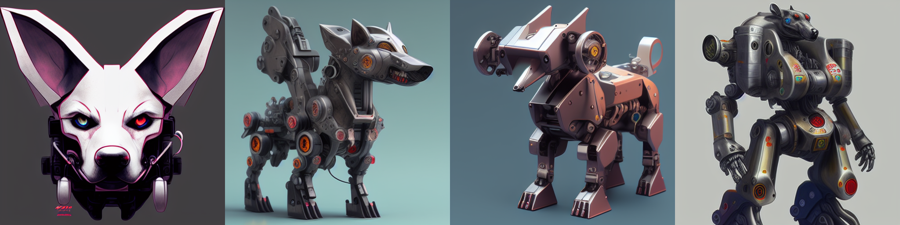
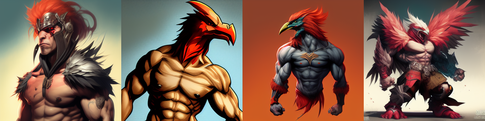
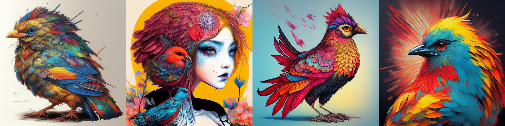

# SkyPaint-Chinese-EN-v-1.0
#### For [Chinese Document](https://github.com/SkyWorkAIGC/SkyPaint-AI-Diffusion/blob/main/README-CN.md)
#### Hugging Face Home Page: [Link](https://huggingface.co/SkyWork/SkyPaint)

#### SkyPaint is a Chinese-English bilingual text-generated image project developed by Singularity-AI. It is still being updated and optimized. 
#### Using our model, input some Chinese or English text, then the machine can generate images with modern artistic style just like human painters. Here are some examples:

# Show Cases

### Chinese
机械狗


城堡 大海 夕阳 宫崎骏动画


花落知多少


半鸡半人，强壮


鸡你太美



# Trial and experience

Please visit [SkyPaint](https://sky-paint.singularity-ai.com/index.html#/)


#### You can also can the QR code below with WeChat to experience the model.


# Model Advantages
The SkyPaint text generation image model is mainly composed of two parts, namely the prompt word text encoder model and the diffusion model. Therefore, our optimization is also divided into two steps. First, based on OpenAI-CLIP, we optimized the prompt word text encoder model to make SkyPaint have the ability to recognize Chinese and English, and then optimized the diffusion model, so that SkyPaint has modern artistic capabilities and can produce high-quality pictures.

# Model Function
* Chinese and English mixed prompt word input.
* Generating high-quality images in a modern art styles.
* English prompt words for stable_diffusion_1.x official model and related fine-tuning models.
* Retain usage habits and methods of stable_diffusion prompt words.


# Test cases

Download model: [SkyPaint-v1.0](https://sai-hk.oss-cn-hongkong.aliyuncs.com/zb/skypaint-v-1.0.zip?OSSAccessKeyId=LTAI5tHuxqp63n5qw5eeB6Ji&Expires=1673528832&Signature=4PTeknRoXuHWmeQHXqgu8kB0q%2Bw%3D) 

```py
from diffusers import StableDiffusionPipeline

device = 'cuda'
pipe = StableDiffusionPipeline.from_pretrained("path_to_our_model").to(device)

prompts = [
    '机械狗',
    '城堡 大海 夕阳 宫崎骏动画',
    '花落知多少',
    '鸡你太美',
]

for prompt in prompts:
    prompt = 'sai-v1 art, ' + prompt
    image = pipe(prompt).images[0]  
    image.save("%s.jpg" % prompt)
```

————————————————————————————————————————————————————————————

# Introduction to SkyCLIP Models
SkyCLIP is a CLIP model obtained by using an efficient method of training Chinese-English bilingual CLIP models. This method only needs to use text data to achieve efficient distillation of the OpenAI-CLIP model, which greatly reduces the data threshold. At the same time, training requires Compared with the original CLIP model, the computing power requirement is reduced by more than 90%, which is convenient for the open source community to reproduce/fine-tune. This method only changes the text encoder of OpenAI-CLIP, and can be used with the image encoder of OpenAI-CLIP to realize the image-text retrieval function.

### SkyCLIP training data source
* Chinese-English Machine Translation Task Parallel Corpus.
* United Nations Chinese-English Parallel Corpus.
* LAION Chinese and English Corpus (Part).
* Wukong Chinese Corpus (Part).
* AI-Challenger translation task Chinese and English corpus.
* Chinese and English corpus of ancient poetry.
* A Chinese and English corpus composed of common words in the prompt word handbook/magic book.

### SkyCLIP training method
Use the text_encoder of OpenAI-CLIP as the teacher model and freeze the parameters. The student model uses a multilingual BERT model of the same size as the teacher model. During training, the English input is obtained through the teacher model to obtain the corresponding t_en_hiddent_state, and English and Chinese are respectively obtained through the student model. The corresponding s_en_hiddent_state, s_zh_hidden_state uses l1, l2, cos distance, etc. to construct loss functions so that the Chinese and English hidden_state of the student model gradually approaches the hidden_state of the teacher model. Due to the natural unequal length of Chinese and English in the parallel corpus, in order to make the parallel Chinese and English as close as possible, we also added a Chinese decoder during the training process, and used the Chinese and English hidden_state of the student model as the hidden_state input of the decoder. The translation task is used to assist in the alignment of Chinese and English.

### SkyCLIP Model Evaluation
At present, we mainly evaluate the zero-shot performance of SkyCLIP on Flickr30K-CN, and mainly compare several related open source models with Chinese capabilities. For the L/14 size model, our evaluation process refers to the evaluation script provided by Chinese-CLIP.

**Flickr30K-CN Retrieval**:
<table border="1" width="150%">
	<tr align="center">
        <th>Task</th><th colspan="3">Text-to-Image</th><th colspan="3">Image-to-Text</th>
        <th rowspan="3">MR</th>
    </tr>
    <tr align="center">
        <th>Setup</th><th colspan="3">Zero-shot</th><th colspan="3">Zero-shot</th> 
    </tr>
    <tr align="center">
        <td>Metric</td><td>R@1</td><td>R@5</td><td>R@10</td><td>R@1</td><td>R@5</td><td>R@10</td>
    </tr>
    <tr align="center">
        <td width="120%">Taiyi-326M</td><td>53.8</td><td>79.9</td><td>86.6</td><td>64.0</td><td>90.4</td><td>96.1</td><td>78.47</td>
    </tr>
    <tr align="center">
        <td width="120%">AltCLIP</td><td>50.7</td><td>75.4</td><td>83.1</td><td>73.4</td><td>92.8</td><td>96.9</td><td>78.72</td>
    </tr>
	<tr align="center">
        <td width="120%">Wukong</td><td>51.9</td><td>78.6</td><td>85.9</td><td>75</td><td>94.4</td><td>97.7</td><td>80.57</td>
    </tr>
	<tr align="center">
        <td width="120%">R2D2</td><td>42.6</td><td>69.5</td><td>78.6</td><td>63.0</td><td>90.1</td><td>96.4</td><td>73.37</td>
    </tr>
	<tr align="center">
        <td width="120%">CN-CLIP</td><td>68.1</td><td>89.7</td><td>94.5</td><td>80.2</td><td>96.6</td><td>98.2</td><td>87.87</td>
    </tr>
    <tr align="center">
        <td width="120%">SkyCLIP</td><td>58.8</td><td>82.6</td><td>89.6</td><td>78.8</td><td>96.1</td><td>98.3</td><td>84.04</td>
    </tr>
</table>
<br>

### SkyCLIP calculates image-text similarity
```py
from PIL import Image
import requests
import clip
import torch
from transformers import BertTokenizer
from transformers import CLIPProcessor, CLIPModel, CLIPTextModel
import numpy as np

query_texts = ['一个人', '一辆汽车', '两个男人', '两个女人']  # 这里是输入提示词，可以随意替换。
# 加载SkyCLIP 中英文双语 text_encoder
text_tokenizer = BertTokenizer.from_pretrained("./tokenizer")
text_encoder = CLIPTextModel.from_pretrained("./text_encoder").eval()
text = text_tokenizer(query_texts, return_tensors='pt', padding=True)['input_ids']

url = "http://images.cocodataset.org/val2017/000000040083.jpg"  #这里可以换成任意图片的url
# 加载CLIP的image encoder
clip_model = CLIPModel.from_pretrained("openai/clip-vit-large-patch14")
clip_text_proj = clip_model.text_projection
processor = CLIPProcessor.from_pretrained("openai/clip-vit-large-patch14")
image = processor(images=Image.open(requests.get(url, stream=True).raw), return_tensors="pt")

with torch.no_grad():
    image_features = clip_model.get_image_features(**image)
    text_features = text_encoder(text)[0]
    # sep_token对应于openai-clip的eot_token
    sep_index = torch.nonzero(text == student_tokenizer.sep_token_id)
    text_features = text_features[torch.arange(text.shape[0]), sep_index[:, 1]]
    # 乘text投影矩阵
    text_features = clip_text_proj(text_features)
    image_features = image_features / image_features.norm(dim=1, keepdim=True)
    text_features = text_features / text_features.norm(dim=1, keepdim=True)
    # 计算余弦相似度 logit_scale是尺度系数
    logit_scale = clip_model.logit_scale.exp()
    logits_per_image = logit_scale * image_features @ text_features.t()
    logits_per_text = logits_per_image.t()
    probs = logits_per_image.softmax(dim=-1).cpu().numpy()
    print(np.around(probs, 3))

```

### Diffusion Model
Our data uses the filtered Laion data set as the training data, and adds 'sai-v1 art' as the tag in front of the text so that the model can learn the style and quality we want more quickly. The pre-training model uses [stable-diffusion-v1-5](https://huggingface.co/runwayml/stable-diffusion-v1-5) as pre-training, and uses 16 A100s for 50 hours of training. The current model is still being optimized, and there will be more stable model updates in the future.


# License
- [CreativeML Open RAIL-M](LICENSE-MODEL)

# Developer group
#### Scan the QR code below with WeChat to join in the developer group:


